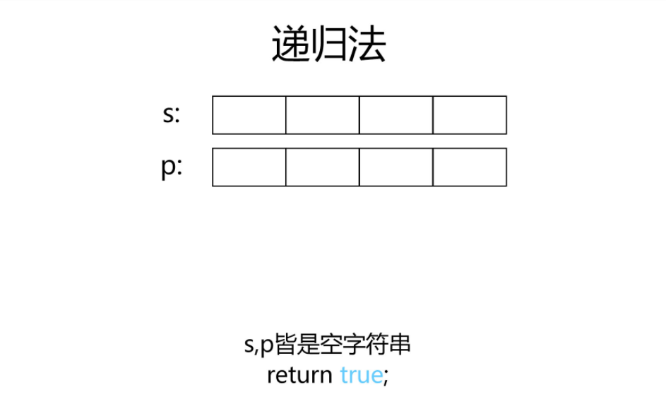
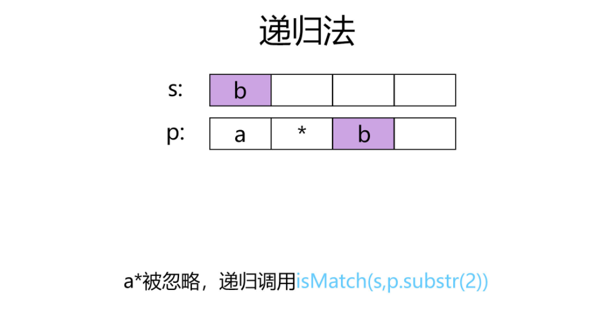
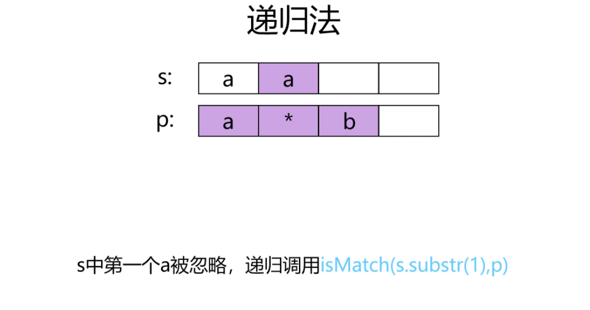
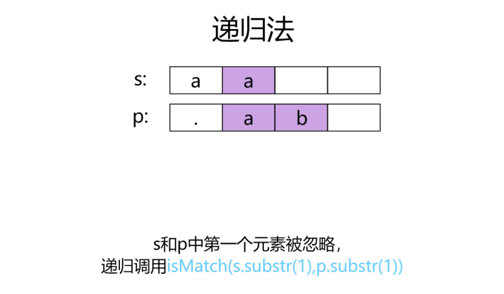
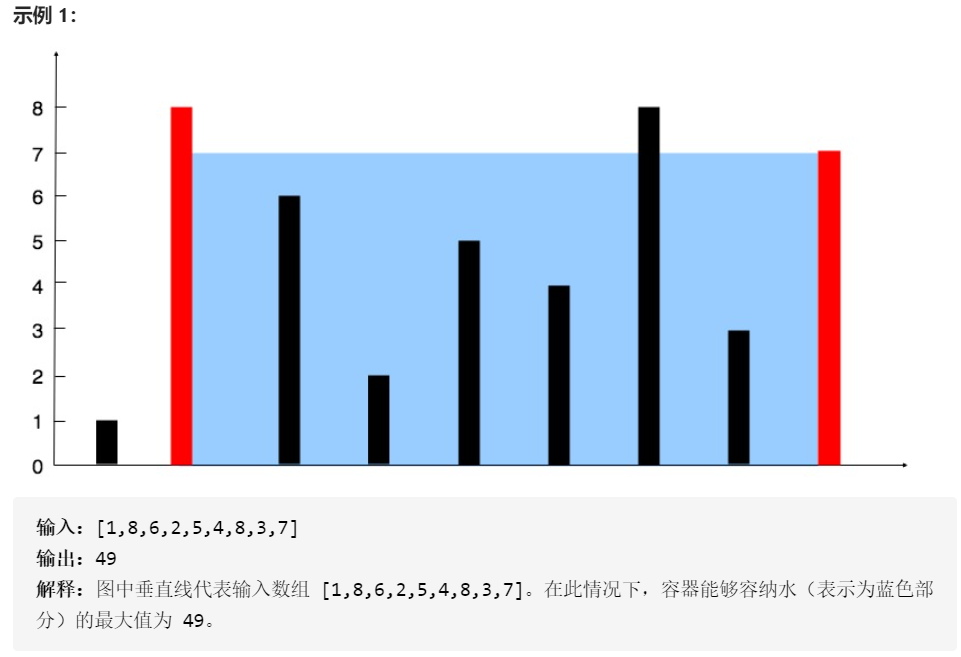

# LEETCODE练习记录
<!-- TOC -->

- [LEETCODE练习记录](#leetcode练习记录)
    - [1.两数求和](#1两数求和)
        - [题设：](#题设)
        - [示例：](#示例)
        - [思路：](#思路)
    - [2.两数相加](#2两数相加)
        - [题设：](#题设-1)
        - [示例：](#示例-1)
        - [思路：](#思路-1)
    - [3.无重复字符的最长子串](#3无重复字符的最长子串)
        - [题设：](#题设-2)
        - [示例：](#示例-2)
        - [思路：](#思路-2)
    - [4.寻找两个正序数组的中位数](#4寻找两个正序数组的中位数)
        - [题设：](#题设-3)
        - [示例：](#示例-3)
        - [思路：](#思路-3)
    - [5.最长回文子串](#5最长回文子串)
        - [题设：](#题设-4)
        - [示例：](#示例-4)
        - [思路：](#思路-4)
    - [6.Z字形变换](#6z字形变换)
        - [题设：](#题设-5)
        - [示例：](#示例-5)
        - [思路：](#思路-5)
    - [7.整数反转](#7整数反转)
        - [题设：](#题设-6)
        - [示例：](#示例-6)
        - [思路：](#思路-6)
    - [8.字符串转换整数](#8字符串转换整数)
        - [题设：](#题设-7)
        - [示例：](#示例-7)
        - [思路：](#思路-7)
    - [9.回文数](#9回文数)
        - [题设：](#题设-8)
        - [示例：](#示例-8)
        - [思路：](#思路-8)
    - [10.正则表达式匹配](#10正则表达式匹配)
        - [题设：](#题设-9)
        - [示例：](#示例-9)
        - [思路：](#思路-9)
    - [11.成最多水的容器](#11成最多水的容器)
        - [题设：](#题设-10)
        - [示例：](#示例-10)
        - [思路：](#思路-10)
    - [12.整数转罗马数字](#12整数转罗马数字)
        - [题设：](#题设-11)
        - [示例：](#示例-11)
        - [思路：](#思路-11)
    - [13.罗马数字转整数](#13罗马数字转整数)
        - [题设：](#题设-12)
        - [示例：](#示例-12)
        - [思路：](#思路-12)
    - [14.最长公共前缀](#14最长公共前缀)
        - [题设：](#题设-13)
        - [示例：](#示例-13)
        - [思路：](#思路-13)
    - [15.三数之和](#15三数之和)
        - [题设：](#题设-14)
        - [示例：](#示例-14)
        - [思路：](#思路-14)
    - [16.最接近的三数之和](#16最接近的三数之和)
        - [题设：](#题设-15)
        - [示例：](#示例-15)
        - [思路：](#思路-15)

<!-- /TOC -->
## 1.两数求和
### 题设：
给定一个整数数组 nums 和一个整数目标值 target，请你在该数组中找出 和为目标值 的那 两个 整数，并返回它们的数组下标。

你可以假设每种输入只会对应一个答案。但是，数组中同一个元素不能使用两遍。

你可以按任意顺序返回答案。  
### 示例：
输入：nums = [2,7,11,15], target = 9  
输出：[0,1]  
解释：因为 nums[0] + nums[1] == 9  
返回 [0, 1] 

### 思路：
①.暴力求解：将数组中的每一个数都与其后的数进行相加，每次得到结果与目标值进行比较，相同则返回对应下标。 
```c++
vector<int> twoSum(vector<int>& nums, int target) {
    int n=nums.size();
    for(int i=0;i<n-1;i++)
    {
        for(int j=i+1;j<n;j++)
        {
            if(nums[i]+nums[j]==target)
            {
                return {i,j};
            }
        }
    }
    return {};
    }
``` 
②.利用散列表，将数组元素及其下标看作一个整体，在存入散列表的过程中，判断目标与当前元素的差值是否在散列中，存在则返回对应下标。  
```c++
vector<int> twoSum(vector<int>& nums, int target) {
    int n=nums.size();
    map<int, int> b;
    for (int i = 0; i < n; i++)
    {
        pair<int, int> c(nums[i], i);
        if (b.find(target - nums[i]) != b.end())
        {
            return {b.find(target - nums[i])->second,i};//map自带find
            break;
        }
        b.insert(c);
    }
    return {};
    }
```

## 2.两数相加
### 题设：
给你两个 非空 的链表，表示两个非负的整数。它们每位数字都是按照 逆序 的方式存储的，并且每个节点只能存储 一位 数字。

请你将两个数相加，并以相同形式返回一个表示和的链表。

你可以假设除了数字 0 之外，这两个数都不会以 0 开头。  

### 示例：
输入：l1 = [2,4,3], l2 = [5,6,4]  
输出：[7,0,8]  
解释：342 + 465 = 807.

### 思路：
首先确定两个链表的长度，短的一方在其后补0，使位数相同，从头开始对应位置的数字相加，判断是否大于等于十，是则进位，原位置存放对十求余的结果。
```c++
struct ListNode
{
    int val;
    ListNode *next;
    ListNode() : val(0), next(nullptr) {}
    ListNode(int x) : val(x), next(nullptr) {}
    ListNode(int x, ListNode *next) : val(x), next(next) {}
};

class Solution
{
public:
    ListNode *addTwoNumbers(ListNode *l1, ListNode *l2)
    {
        int s1 = 1; //初始化链表长度
        int s2 = 1;
        ListNode *p = l1;       //l1的游标
        ListNode *q = l2;       //l2的游标
        while (p->next != NULL) //记录链表的长度
        {
            s1 += 1;
            p = p->next;
        }
        while (q->next != NULL)
        {
            s2 += 1;
            q = q->next;
        }
        if (s1 < s2) //短的链表补零
        {
            for (int i = 0; i < s2 - s1; i++)
            {
                p->next = new ListNode(0);
                p = p->next;
            }
        }
        else if (s1 > s2)
        {
            for (int i = 0; i < s1 - s2; i++)
            {
                q->next = new ListNode(0);
                q = q->next;
            }
        }
        bool count = false; //进位标志初始为false(0)
        p = l1;             //游标初始化
        q = l2;
        ListNode *r3 = new ListNode(-1); //盛放结果的链表
        ListNode *t3 = r3;               //结果链表的游标
        int temp = 0;                    //临时存放数字
        while (p != NULL && q != NULL)
        { //对应位置相加（连带进位标志），大于10则进位且原位对10求余
            temp = count + p->val + q->val;
            if (temp >= 10)
            {
                count = true;
            }
            else
            {
                count = false;
            }
            t3->next = new ListNode(temp % 10);
            p = p->next;
            q = q->next;
            t3 = t3->next;
        }
        if (count)
        { //如果最高位相加需进位则进行添一
            t3->next = new ListNode(1);
            t3 = t3->next;
        }
        r3 = r3->next; //返回结果不包括头节点
        return r3;
    }
};
```
## 3.无重复字符的最长子串
### 题设：
给定一个字符串，请你找出其中不含有重复字符的 最长子串 的长度。  
### 示例：
输入: s = "abcabcbb"  
输出: 3   
解释: 因为无重复字符的最长子串是 "abc"，所以其长度为 3。  
### 思路：
滑动窗口解决问题，设置两个游标和初始字符串长度，当末尾游标小于原字符总长度时，从开始位置游标起，判断结尾游标是否出现，如果出现，则开始游标跳过重复，产生新的字符串，判断新字符串与原字符串的长度得到结果
```c++
class Solution
{
public:
    int lengthOfLongestSubstring(string s)
    {
        int start = 0;  //窗口开始
        int end = 0;    //窗口结束
        int length = 0; //临时长度
        int result = 0; //最终结果
        while (end < s.size())
        {                       //未进行到最后
            char temp = s[end]; //临时存储字符
            for (int i = start; i < end; i++)
            { //判断是否在之前出现
                if (temp == s[i])
                {
                    start = i + 1;
                    length = end - start;
                    break;
                }
            }
            end++;
            length++;
            result = max(result, length);
        }
        return result;
    }
};
```
## 4.寻找两个正序数组的中位数
### 题设：
给定两个大小为 m 和 n 的正序（从小到大）数组 nums1 和 nums2。请你找出并返回这两个正序数组的中位数。

进阶：你能设计一个时间复杂度为 O(log (m+n)) 的算法解决此问题吗？
### 示例：
输入：nums1 = [1,3], nums2 = [2]  
输出：2.00000  
解释：合并数组 = [1,2,3] ，中位数 2
### 思路：
给出的两个数组都是有序的，那么利用简单归并的方式将两个数组进行合并，然后通过中位数的算法得到结果，考虑偶数情况。
```c++
double findMedianSortedArrays(vector<int> &nums1, vector<int> &nums2)
{ //归并求中位数
    int l1 = nums1.size();
    int l2 = nums2.size();
    vector<int> result(l1 + l2);
    int i = 0; //第一个数组的游标
    int j = 0; //第二个数组的游标
    int k = 0; //结果数组的游标
    while (i < l1 && j < l2)
    { //进行归并
        if (nums1[i] < nums2[j])
        {
            result[k] = nums1[i];
            k++;
            i++;
        }
        else
        {
            result[k] = nums2[j];
            k++;
            j++;
        }
    }
    while (i < l1)
    { //第一个数组有剩余
        result[k] = nums1[i];
        k++;
        i++;
    }
    while (j < l2)
    { //第二个数组有剩余
        result[k] = nums2[j];
        k++;
        j++;
    }
    int l3 = result.size();
    if (l3 % 2 == 0)
    { //返回中位数
        return (double(result[l3 / 2 - 1]) + double(result[l3 / 2])) / 2;
    }
    else
    {
        return double(result[l3 / 2]);
    }
}
```
## 5.最长回文子串
### 题设：
给你一个字符串 s，找到 s 中最长的回文子串。
### 示例：
输入：s = "babad"  
输出："bab"  
解释："aba" 同样是符合题意的答案。
### 思路：
中心扩展法：从字符串的开始，向两边进行扩展，记录每次形成回文的长度，考虑一个中心和两个中心的情况，得到最后结果
```c++
class Solution {
public:
    string longestPalindrome(string s)
{
    int n = s.length();
    int start = 0;
    int end = 0;
    int len = 0;
    for (int i = 0; i < n; i++)
    {
        int len1 = excenter(s, i, i);
        int len2 = excenter(s, i, i + 1);
        len = max(max(len1, len2), len);
        if (len > end - start + 1)
        {
            start = i - (len - 1) / 2;
            end = i + len / 2;
        }
    }
    return s.substr(start, len);
}
private:
    int excenter(string &s, int left, int right)
{
    int L = left;
    int R = right;
    while (L >= 0 && R < s.length() && s[L] == s[R])
    {
        L--;
        R++;
    }
    return R - L - 1;
}
};
```
## 6.Z字形变换
### 题设：
将一个给定字符串 s 根据给定的行数 numRows ，以从上往下、从左到右进行 Z 字形排列。

比如输入字符串为 "PAYPALISHIRING" 行数为 3  
之后，你的输出需要从左往右逐行读取，产生出一个新的字符串，比如："PAHNAPLSIIGYIR"。

请你实现这个将字符串进行指定行数变换的函数：

string convert(string s, int numRows);
### 示例：
输入：s = "PAYPALISHIRING", numRows = 3  
输出："PAHNAPLSIIGYIR"
### 思路：
根据给出图示，发现如下规律：当以行数最为标准时，当字符串下标为0或（numofrows-1）时排列的方向发生翻折，可以创建string类型数组，通过下标之间的关系得到最终结果。
```c++
string convert(string s, int numRows)
{
    if (numRows == 1)
        return s;                                     //如果一行，则直接返回
    vector<string> rows(min(numRows, int(s.size()))); //确保不会超出限制

    int current = 0; //行的游标
    bool op = false; //是否转向
    for (char c : s)
    {                       //c在s中，找到应该出现的位置
        rows[current] += c; //对应位置字符串相加
        if (current == 0 || current == numRows - 1)
        { //转向条件
            op = !op;
        }
        if (op)
        {
            current += 1;
        }
        else
        {
            current += (-1);
        }
    }
    string result; //返回结果
    for (string x : rows)
    {
        result += x;
    }
    return result;
}
```
## 7.整数反转
### 题设：
给你一个 32 位的有符号整数 x ，返回 x 中每位上的数字反转后的结果。

如果反转后整数超过 32 位的有符号整数的范围 [−231,  231 − 1] ，就返回 0。

假设环境不允许存储 64 位整数（有符号或无符号）。
### 示例：
输入：x = 123  
输出：321
### 思路：
对传入的整数进行对十求余得到每一位，乘十后再相加，原数不断自除十，同时考虑溢出，判断溢出时比较当前结果与最大最小值/10的结果，并比较当前位与7，-8的大小关系。
```c++
int reverse(int x)
{
    int result = 0;
    while (x != 0)
    {                                                                     //当传入参数不为零时进入循环
        int pop = x % 10;                                                 //取出最末尾一位
        if (result > INT_MAX / 10 || (result == INT_MAX / 10 && pop > 7)) //判断是否溢出
            return 0;                                                     //最大值末尾7，最小值末尾8
        if (result < INT_MIN / 10 || (result == INT_MIN && pop < -8))
            return 0;
        result = result * 10 + x % 10; //进行迭代
        x = x / 10;
    }
    return result;
}
```
## 8.字符串转换整数
### 题设：
请你来实现一个 myAtoi(string s) 函数，使其能将字符串转换成一个 32 位有符号整数（类似 C/C++ 中的 atoi 函数）。

函数 myAtoi(string s) 的算法如下：

读入字符串并丢弃无用的前导空格
检查第一个字符（假设还未到字符末尾）为正还是负号，读取该字符（如果有）。 确定最终结果是负数还是正数。 如果两者都不存在，则假定结果为正。
读入下一个字符，直到到达下一个非数字字符或到达输入的结尾。字符串的其余部分将被忽略。
将前面步骤读入的这些数字转换为整数（即，"123" -> 123， "0032" -> 32）。如果没有读入数字，则整数为 0 。必要时更改符号（从步骤 2 开始）。
如果整数数超过 32 位有符号整数范围 [−231,  231 − 1] ，需要截断这个整数，使其保持在这个范围内。具体来说，小于 −231 的整数应该被固定为 −231 ，大于 231 − 1 的整数应该被固定为 231 − 1 。
返回整数作为最终结果。
注意：

本题中的空白字符只包括空格字符 ' ' 。
除前导空格或数字后的其余字符串外，请勿忽略 任何其他字符

### 示例：
输入：str = "42"  
输出：42  
解释：加粗的字符串为已经读入的字符，插入符号是当前读取的字符。  
第 1 步："42"（当前没有读入字符，因为没有前导空格）  
第 2 步："42"（当前没有读入字符，因为这里不存在 '-' 或者 '+'）  
第 3 步："42"（读入 "42"）  
解析得到整数 42 。  
由于 "42" 在范围 [-231, 231 - 1] 内，最终结果为 42 。
### 思路：
首先处理空白字符' '，在字符串长度范围内进行循环，当遇到第一个非空白字符时进行判断，+、-或数字，其余字符则返回0，当遇到第一个数字字符时，判断是否溢出后，进行迭代，将字符转化成数字（减去'0'）。
```c++
int myAtoi(string s)
{
    int i = 0;      //字符串的游标
    int sign = 1;   //正负标志
    int result = 0; //结果
    while (s[i] == ' ' && i < s.size())
    { //处理' '游标向后移动
        i++;
    }
    if (i == s.size())
    { //全为' '返回零
        return 0;
    }
    //处理第一个非' '字符
    if (s[i] == '-')
    { //负号读入，游标向后移动，正负标识改变
        sign = -1;
        i++;
    }
    else if (s[i] == '+')
    { //正号读入，游标向后移动
        i++;
    }

    else if (!isdigit(s[i]))
    { //读入非数字型字符，返回零
        return 0;
    }
    while (isdigit(s[i]) && i < s.size())
    { //读入字符为数字且在范围内
        if ((INT_MAX - (s[i] - '0')) / 10 < result)
        { //如果溢出
            if (sign == -1)
            { //负数返回最小值
                return INT_MIN;
            }
            else
            { //正数返回最大值
                return INT_MAX;
            }
        }
        result = result * 10 + (s[i] - '0'); //进行迭代
        i++;
    }
    return sign * result; //返回结果
}
```
## 9.回文数
### 题设：
判断一个整数是否是回文数。回文数是指正序（从左向右）和倒序（从右向左）读都是一样的整数。
### 示例：
输入: -121  
输出: false  
解释: 从左向右读, 为 -121 。 从右向左读, 为 121- 。因此它不是一个回文数。
### 思路：
将传入的数字转化成字符串，将该字符串倒置，比较倒置后的字符串与原字符串，相同则为回文数。
```c++
bool isPalindrome(int x)
{
    string temp = to_string(x); //将数字转化为字符串
    int nums = temp.size();     //得到字符串的长度
    string result;
    for (int i = nums - 1; i >= 0; i--) //进行翻转
    {
        result += temp[i];
    }
    if (result == temp) //正反相同则为回文数
    {
        return true;
    }
    else
    {
        return false;
    }
}
```
## 10.正则表达式匹配
### 题设：
给你一个字符串 s 和一个字符规律 p，请你来实现一个支持 '.' 和 '*' 的正则表达式匹配。

'.' 匹配任意单个字符
'*' 匹配零个或多个前面的那一个元素
所谓匹配，是要涵盖 整个 字符串 s的，而不是部分字符串。
### 示例：
输入：s = "aa" p = "a"  
输出：false  
解释："a" 无法匹配 "aa" 整个字符串。  

输入：s = "aa" p = "a*"  
输出：true  
解释：因为 '*' 代表可以匹配零个或多个前面的那一个元素, 在这里前面的元素就是 'a'。因此，字符串 "aa" 可被视为 'a' 重复了一次。
### 思路：
①.利用递归解决问题：  
  
  
  
  
```c++
bool isMatch(string s, string p)
{ //利用递归解决
    if (p.empty())
    { //如果p为空，则判断s是否为空
        return s.empty();
    }
    if ('*' == p[1])
    {//如果第二个字符为*，则进行递归
        return isMatch(s, p.substr(2)) || (!s.empty() && (s[0] == p[0] || '.' == p[0]) && isMatch(s.substr(1), p));
    }
    else
    {
        return !s.empty() && (s[0] == p[0] || '.' == p[0]) && (isMatch(s.substr(1), p.substr(1)));
    }
}
```
②.动态规划：  
详情请见：[动态规划解决正则匹配](https://leetcode-cn.com/problems/regular-expression-matching/solution/zheng-ze-biao-da-shi-pi-pei-by-leetcode-solution/) 
```c++
bool isMatch(string s, string p)
{ //动态规划解决正则匹配
    int m = s.size();
    int n = p.size();

    //状态转移方程的定义
    auto matches = [&](int i, int j) {
        if (i == 0)
        {
            return false;
        }
        if (p[j - 1] == '.')
        {
            return true;
        }
        return s[i - 1] == p[j - 1];
    };

    vector<vector<int>> f(m + 1, vector<int>(n + 1)); //f[i][j] 表示 s 的前 i 个字符与 p 中的前 j 个字符是否能够匹配
    f[0][0] = true;                                   //边界条件
    for (int i = 0; i <= m; ++i)
    {
        for (int j = 1; j <= n; ++j)
        {
            if (p[j - 1] == '*')
            {
                f[i][j] |= f[i][j - 2];
                if (matches(i, j - 1))
                {
                    f[i][j] |= f[i - 1][j];
                }
            }
            else
            {
                if (matches(i, j))
                {
                    f[i][j] |= f[i - 1][j - 1];
                }
            }
        }
    }
    return f[m][n];
}
```
## 11.成最多水的容器
### 题设：
给你 n 个非负整数 a1，a2，...，an，每个数代表坐标中的一个点 (i, ai) 。在坐标内画 n 条垂直线，垂直线 i 的两个端点分别为 (i, ai) 和 (i, 0) 。找出其中的两条线，使得它们与 x 轴共同构成的容器可以容纳最多的水。

说明：你不能倾斜容器。
### 示例：
  
### 思路：
①.暴力枚举：  
找出所有可能的情况，比较后得到最后答案，由于短板效应，计算时以两者中较小的一方作为高，下标差作为宽。
```c++
int maxArea(vector<int> &height)
{ //枚举所有可能情况，找出最大值
    int max_area = 0;
    for (int i = 0; i < height.size(); i++)
    {
        for (int j = i + 1; j < height.size(); j++)
        {
            int temp_area = min(height[i], height[j]) * (j - i);
            max_area = max(max_area, temp_area);
        }
    }
    return max_area;
}
```
②.贪心算法：
双游标移动，头尾个设立一个游标，根据所指向数据的大小确定游标移动的次序，直到循环结束，只遍历一遍数据。
```c++
int maxArea(vector<int> &height)
{ //贪心算法，双游标移动
    int len = height.size();
    int i = 0;
    int j = len - 1;
    int max_area = 0;
    while (i < j)
    {
        int temp_area = min(height[i], height[j]) * (j - i);
        max_area = max(max_area, temp_area);
        if (height[i] < height[j])
        {
            i++;
        }
        else
        {
            j--;
        }
    }
    return max_area;
}
```
## 12.整数转罗马数字
### 题设：
罗马数字包含以下七种字符： I， V， X， L，C，D 和 M。
|字符|数值|
|:----|:----| 
|I|1|  
|V             |5 | 
|X             |10 | 
|L             |50 | 
|C             |100 | 
|D             |500 | 
|M             |1000|  
例如， 罗马数字 2 写做 II ，即为两个并列的 1。12 写做 XII ，即为 X + II 。 27 写做  XXVII, 即为 XX + V + II 。

通常情况下，罗马数字中小的数字在大的数字的右边。但也存在特例，例如 4 不写做 IIII，而是 IV。数字 1 在数字 5 的左边，所表示的数等于大数 5 减小数 1 得到的数值 4 。同样地，数字 9 表示为 IX。这个特殊的规则只适用于以下六种情况：

I 可以放在 V (5) 和 X (10) 的左边，来表示 4 和 9。
X 可以放在 L (50) 和 C (100) 的左边，来表示 40 和 90。 
C 可以放在 D (500) 和 M (1000) 的左边，来表示 400 和 900。
给定一个整数，将其转为罗马数字。输入确保在 1 到 3999 的范围内。
### 示例：
输入: 3   
输出: "III"
### 思路：
①.由题意可得，罗马数字的组合共有13种，从代表最大数字1000的M开始，原数字不断与所代表数字进行比较，如果大于则进行累减，直到小于换下一个数字进行比较，直到原数字为0；
```c++
string intToRoman(int num)
{
    //人造哈希表
    int number[13] = {1000, 900, 500, 400, 100, 90, 50, 40, 10, 9, 5, 4, 1};
    string roman[13] = {"M", "CM", "D", "CD", "C", "XC", "L", "XL", "X", "IX", "V", "IV", "I"};
    string re;
    for (int i = 0; i < 13 && num > 0; i++)
    { //从最大开始逐步进行减法
        int x = number[i];
        string c = roman[i];
        while (num > x)
        {
            re += c;
            num -= x;
        }
    }
    return re;
}
```
②.与①的思路基本一致，直接使用条件语句进行匹配
```c++
string intToRoman(int num)
{
    //进行匹配
    string re;
    while (num > 0)
    {
        if (num >= 1000)
        {
            re += "M";
            num -= 1000;
        }
        else if (num >= 900)
        {
            re += "CM";
            num -= 900;
        }
        else if (num >= 500)
        {
            re += "D";
            num -= 500;
        }
        else if (num >= 400)
        {
            re += "CD";
            num -= 400;
        }
        else if (num >= 100)
        {
            re += "C";
            num -= 100;
        }
        else if (num >= 90)
        {
            re += "XC";
            num -= 90;
        }
        else if (num >= 50)
        {
            re += "L";
            num -= 50;
        }
        else if (num >= 40)
        {
            re += "XL";
            num -= 40;
        }
        else if (num >= 10)
        {
            re += "X";
            num -= 10;
        }
        else if (num >= 9)
        {
            re += "IX";
            num -= 9;
        }
        else if (num >= 5)
        {
            re += "V";
            num -= 5;
        }
        else if (num >= 4)
        {
            re += "IV";
            num -= 4;
        }
        else if (num >= 1)
        {
            re += "I";
            num -= 1;
        }
    }
    return re;
}
```
## 13.罗马数字转整数
### 题设：
罗马数字包含以下七种字符： I， V， X， L，C，D 和 M。
|字符|数值|
|:----|:----| 
|I|1|  
|V             |5 | 
|X             |10 | 
|L             |50 | 
|C             |100 | 
|D             |500 | 
|M             |1000|
例如， 罗马数字 2 写做 II ，即为两个并列的 1。12 写做 XII ，即为 X + II 。 27 写做  XXVII, 即为 XX + V + II 。

通常情况下，罗马数字中小的数字在大的数字的右边。但也存在特例，例如 4 不写做 IIII，而是 IV。数字 1 在数字 5 的左边，所表示的数等于大数 5 减小数 1 得到的数值 4 。同样地，数字 9 表示为 IX。这个特殊的规则只适用于以下六种情况：

I 可以放在 V (5) 和 X (10) 的左边，来表示 4 和 9。  
X 可以放在 L (50) 和 C (100) 的左边，来表示 40 和 90。   
C 可以放在 D (500) 和 M (1000) 的左边，来表示 400 和 900。  
给定一个罗马数字，将其转换成整数。输入确保在 1 到 3999 的范围内。
### 示例：
输入: "III"   
输出: 3
### 思路：
读入罗马数字后，先将每一位字母所代表数字相加，再从头开始判断是否有特殊组合（6种），如果存在则减去差值。
```c++
int romanToInt(string s)
{
    int len = s.size();
    int result = 0;
    for (int i = 0; i < len; i++)
    {
        if (s[i] == 'I')
        {
            result += 1;
        }
        else if (s[i] == 'V')
        {
            result += 5;
        }
        else if (s[i] == 'X')
        {
            result += 10;
        }
        else if (s[i] == 'L')
        {
            result += 50;
        }
        else if (s[i] == 'C')
        {
            result += 100;
        }
        else if (s[i] == 'D')
        {
            result += 500;
        }
        else if (s[i] == 'M')
        {
            result += 1000;
        }
    }
    for (int j = 0; j < len - 1; j++)
    {
        if ((s[j] == 'I' && s[j + 1] == 'V') || (s[j] == 'I' && s[j + 1] == 'X'))
        {
            result -= 2;
        }
        else if ((s[j] == 'X' && s[j + 1] == 'L') || (s[j] == 'X' && s[j + 1] == 'C'))
        {
            result -= 20;
        }
        else if ((s[j] == 'C' && s[j + 1] == 'D') || (s[j] == 'C' && s[j + 1] == 'M'))
        {
            result -= 200;
        }
    }
    return result;
}
```
## 14.最长公共前缀
### 题设：
编写一个函数来查找字符串数组中的最长公共前缀。

如果不存在公共前缀，返回空字符串 ""。
### 示例：
输入：strs = ["flower","flow","flight"]  
输出："fl"
### 思路：
首先检验特殊情况，传入数组为空，传入数组只有一个元素，传入数组的第一个元素为空字符串，然后将第一个元素作为基准，进行逐字的比较，得到最后答案。
```c++
string longestCommonPrefix(vector<string> &strs)
{
    if (strs.size() == 0)
        return "";
    if (strs.size() == 1)
        return strs[0];
    if (strs[0].size() == 0)
        return "";
    for (int index = 0;; index++)
    {
        char c = strs[0][index];
        for (int i = 0; i < strs.size(); i++)
        {
            if (strs[i].empty())
                return "";
            if (c != strs[i][index])
                return strs[0].substr(0, index);
            if (strs[i].size() == index)
                return strs[i];
        }
    }
}
```
## 15.三数之和
### 题设：
给你一个包含 n 个整数的数组 nums，判断 nums 中是否存在三个元素 a，b，c ，使得 a + b + c = 0 ？请你找出所有和为 0 且不重复的三元组。

注意：答案中不可以包含重复的三元组。
### 示例：
输入：nums = [-1,0,1,2,-1,-4]   
输出：[[-1,-1,2],[-1,0,1]]
### 思路：
使用排序和双指针的方法，经过排序和去重后，通过左右游标的移动得到最后的答案
```c++
vector<vector<int>> threeSum(vector<int> &nums)
{ //排序+双指针
    int len = nums.size();
    int L = 0;                      //左指针
    int R = 0;                      //右指针
    vector<vector<int>> ans;        //最终答案
    sort(nums.begin(), nums.end()); //排序，默认升序
    if (len < 3)
    { //长度小于三直接返回空
        return ans;
    }
    for (int i = 0; i < len; i++)
    { //去重及计算
        if (nums[i] > 0)
        { //从此时起，由于已经排好序，不会出现为零的和
            return ans;
        }
        if (i > 0 && nums[i] == nums[i - 1])
        { //去重
            continue;
        }
        L = i + 1;   //定位左指针
        R = len - 1; //定位右指针
        while (L < R)
        { //指针进行移动
            if (nums[i] + nums[L] + nums[R] == 0)
            { //得到答案
                vector<int> temp;
                temp.push_back(nums[i]);
                temp.push_back(nums[L]);
                temp.push_back(nums[R]);
                ans.push_back(temp);
                temp.clear();
                while (L < R && nums[L] == nums[L + 1])
                { //去重
                    L += 1;
                }
                while (L < R && nums[R] == nums[R - 1])
                { //去重
                    R -= 1;
                }
                L += 1; //移动游标
                R -= 1;
            }
            else if (nums[i] + nums[L] + nums[R] > 0)
            {
                R -= 1;
            }
            else
            {
                L += 1;
            }
        }
    }
    return ans;
}
```
## 16.最接近的三数之和
### 题设：
给定一个包括 n 个整数的数组 nums 和 一个目标值 target。找出 nums 中的三个整数，使得它们的和与 target 最接近。返回这三个数的和。假定每组输入只存在唯一答案。
### 示例：
输入：nums = [-1,2,1,-4], target = 1  
输出：2  
解释：与 target 最接近的和是 2 (-1 + 2 + 1 = 2) 。
### 思路：
与15题思路类似，在循环中增加一判断条件，比较差值绝对值的大小，的到最后答案
```c++
int threeSumClosest(vector<int> &nums, int target)
{
    int len = nums.size();
    int result = nums[0] + nums[1] + nums[2];
    int L = 0;
    int R = 0;
    sort(nums.begin(), nums.end());
    for (int i = 0; i < len; i++)
    {
        L = i + 1;
        R = len - 1;
        while (L < R)
        {
            int sum = nums[L] + nums[R] + nums[i];
            if (abs(sum - target) < abs(result - target))
            {
                result = sum;
            }
            if (target < sum)
            {
                R--;
            }
            if (target > sum)
            {
                L++;
            }
            if (target == sum)
            {
                return result;
            }
        }
    }
    return result;
}
```

